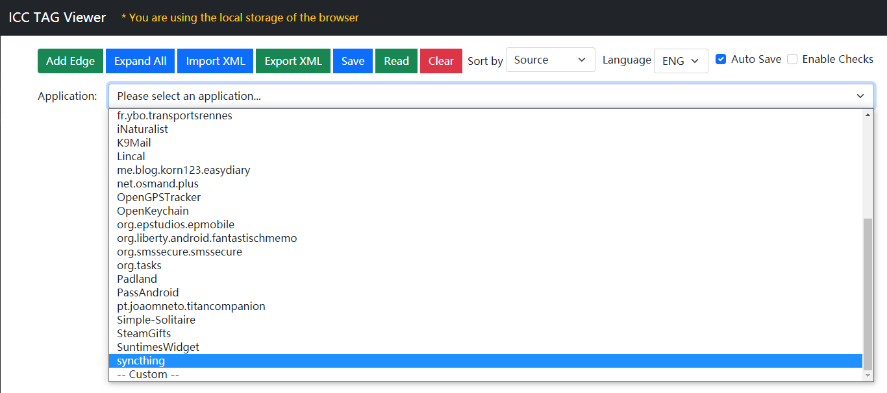
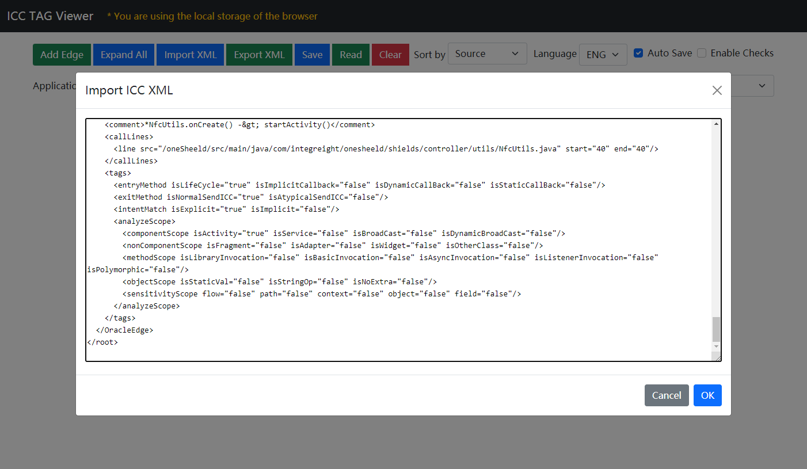
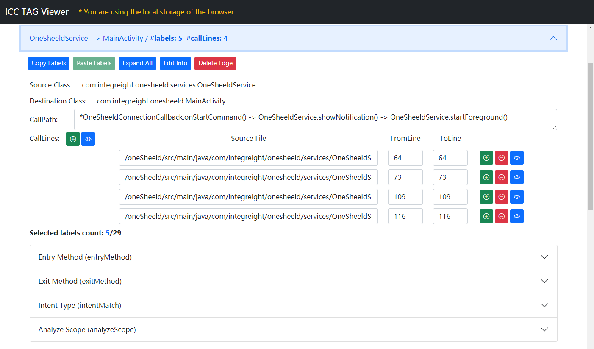

# ICCViewer

ICC Viewer for Android Applications

## Introduction
**ICCViewer**: An ICC viewer for Android applications with 1400+ built-in PRR oracle ICCs for 31 apps.

The website implementation is based on [Bootstrap 5](https://getbootstrap.com), [jQuery](https://jquery.com) and [monaco-editor](https://github.com/microsoft/monaco-editor).

## Features

- **Online Viewing**: View the ICC annotation results of [picked applications](https://github.com/hanada31/ICC-Resolution-Evaluation/tree/main/on%20Picked%20App).

- **Offline Editing**: Edit the ICC annotation through the browser, the data is saved locally, and can be imported and exported.

- **ICC Sorting**: ICCs can be sorted according to **Source Class** and **Destination Class** respectively while editing.

- **Auto Saving**: Automatically save editing results every five minutes (Can be enable / disable manually).

- **Label Checking**: Check the selection of labels according to the call path.

- **Internationalization**: Support multiple languages, with English and Chinese currently.

## Usage

### View the ICCs and their characteristics of picked applications

On the ICCViewer page, click the option in the drop-down menu next to **Application** to view the built-in ICC results of 31 open source apps involved in our experiment.

At the same time, you can also click the **Import XML** button and paste the contents of local ICC annotation XML file into the textarea for viewing.

### Edit ICC annotation

After the ICC annotation data is loaded, each ICC edge will be displayed as a collapsed accordion. Click on the title of accordion to expand the annotation panel.

The following is a brief description of the annotation panel:

- **Copy / Paste Labels**：Copy the selection status of all labels of an ICC edge, and apply it to another ICC edge completely.
- **Expand / Collapse All**: Expand or collapse the accordion of ICC edge or category of labels.
- **Edit Info / Save Change / Discard Change**：Edit the **Source Class** and **Destination Class** of an ICC edge. Need to click **Save Change** to take effect, or **Discard Change** to discard the changes.
- **Delete Edge**: Delete the current ICC edge.
- **Source Class**: The full name of the source class of ICC.
- **Destination Class**: The full name of the destination class of ICC.
- **Call Path**: The call path of ICC, please refers to [Call Path Specification](#call-path-specification)
- **Call Lines**: The line of code where each function call in the call path is located. The first column is the relative path of the source code file, the second and third columns are the starting and ending line number of the code block.
    - **Add Call Line button**: The plus icon `+` in the upper left corner can add a new line at the end, while the plus icon `+` after each line can add a new line above it.
    - **Delete Call Line button**: Delete the current line.
    - **View Source button**: The eye icon at the end of each line can expand the source code file edit box corresponding to the code line. By default, five lines of code before and after are displayed at the same time, and can scroll to view more. The eye icon in the upper left corner can expand / collapse all code viewer of lines at the same time.
- **Selected Labels Count**: Indicates the number of labels that are currently selected, and the number of all labels.
- **Label Accordion**：Each category of label can be collapsed and expanded separately, and each label is presented as a checkbox. The original name and description of the label will be displayed when the mouse is moved to the checkbox.
- **Label Checking**: When the label checking is turned on, the possible problems of label selection will be displayed at the end of accordion panel. Please refers to [Label Checking Based on Call Path](#label-checking-based-on-call-path)

### Create ICC Annotation for Other Applications

After clicking the last option `-- Custom -- ` of the drop-down menu next to **Application**, the **Source Root** edit box will be shown. The default value of source code path is `/ICCViewer/apps`, which is the path corresponding to the `apps` folder in the online version of **ICCViewer**, storing all source code of picked applications in our experiment.

When deploying locally, the storage path of **ICCViewer** and source code can be different. The source code path here is based on the storage path of the source code, which needs to be defined in the `srcBasePath` field in [`js/viewer.core.js`](js/viewer.core.js).

For example, if **ICCViewer** is deployed in `/exp/viewer`, the source code path is `/source/TestApp`, then the `srcCodeBase` field in `/exp/viewer/js/viewer.core.js` should be set as `/source`.

## Call Path Specification
In order to facilitate subsequent inspection and analysis, it is recommend to analyze the call path of the ICC component flow as completely as possible, and fill it in the field `Call Path` of annotation panel. The call path should meet the following rules roughly:

- The call path usually starts from a component's life cycle method or implicit callback method (such as `onOptionsItemSelected`)
- Use two symbols ` -> ` with two spaces to separate each level of calls
- When the call path involves polymorphism, you need to indicate the class inheritance relationship, such as `A.a() -> B extends A -> B.a()`
- Add an asterisk `*` before the last entry method (such as button callback)
- The call path should usually end with the ICC exit
- If something defined in the XML configuration (such as layout and preference, etc.) is used in the call path, the method of loading XML configuration and its corresponding location should be noted, and extra information (such as XML resource path and component ID) should also be noted. For example: ` -> R.layout.main.button1.onClick -> `

Based on above specifications, the following call path annotations are legal:
- `*MainActivity.onCreate() -> startActivity()`
- `Example01Activity.onCreate() -> Button.setOnClickListener() -> *View.OnClickListener.onClick() -> Example01Activity.startActivity()`
- `Example02Activity.onCreate() -> initUI() -> Handler.postDelayed() -> FragmentTransaction.commit() -> TestFragment.onCreateView() -> MaterialDialog.builder.setPositive() -> *View.OnClickListener.onClick() -> TestFragment.startActivity()`

### Label Checking Based on Call Path

On the premise that the call path annotation meets the specifications, the label checking feature can be turned on. It can perform simple rule-based checking according to the call path to avoid some possible problems with manual labeling.

The main checking rules are as follows:

| Rule name | Related labels | Checking logic | Description
| :----- | :----- | :----- | :----- |
| Lifecycle related invocation | `entryMethod.isLifeCycle` | include <-> select, ~include <-> ~select | Whether common life cycle method name appear in the call path
| Suspected implicit callback | `entryMethod.isImplicitCallback` | include -> select | Whether common implicit callback method name appear in the call path
| Suspected dynamic callback | `entryMethod.isDynamicCallBack` | include -> select | Whether common dynamic callback method name appear in the call path
| Suspected static callback | `entryMethod.isStaticCallBack` | include -> select | Whether static resource reference (`R.`) in the call path
| Normal ICC | `exitMethod.isNormalSendICC` | include <-> select, ~include <-> ~select | Whether typical ICC method name appears in the call path
| Suspected Activity class | `analyzeScope.componentScope.isActivity` | include -> select | Whether the `Activity` keyword appears in the class name in the call path
| Suspected Service class | `analyzeScope.componentScope.isService` | include -> select | Whether the `Service` keyword appears in the class name in the call path
| Suspected Receiver class | `analyzeScope.componentScope.isBroadCast`, `analyzeScope.componentScope.isDynamicBroadCast` | include -> select | Whether the `Receiver` keyword appears in the class name in the call path
| Suspected dynamic broadcast | `analyzeScope.componentScope.isDynamicBroadCast` | include -> select | Whether the `registerReceiver` keyword appears in the class name in the call path
| Suspected Fragment invocation | `analyzeScope.nonComponentScope.isFragment` | include -> select | Whether the `Fragment` keyword appears in the class name in the call path
| Suspected Adapter invocation | `analyzeScope.nonComponentScope.isAdapter` | include -> select | Whether the `Adapter` keyword appears in the class name in the call path
| Suspected Widget invocation | `analyzeScope.nonComponentScope.isWidget` | include -> select | Whether the `Widget` keyword appears in the class name in the call path
| Suspected async invocation | `analyzeScope.methodScope.isAsyncInvocation` | include -> select | Whether some keywords related to async invoke appears in the class name in the call path
| Suspected polymorphism | `analyzeScope.methodScope.isAsyncInvocation` | include -> select | Whether the `extends` keyword appears in the class name in the call path
| Explicit intent must not select static value | `intentMatch.isExplicit`, `analyzeScope.objectScope.isStaticVal` | No more than one | Cannot select more than one of the labels
| Either normal ICC or atypical ICC | `exitMethod.isNormalSendICC`, `exitMethod.isAtypicalSendICC` | Equals to one | Can only select one of the labels
| Component type should be selected | `analyzeScope.componentScope.isActivity / isService / isBroadCast / isDynamicBroadCast` | No less than one | Cannot select less than one of the labels
| Intent type should be selected | `intentMatch.isExplicit / isImplicit` | Equals to one | Can only select one of the labels
